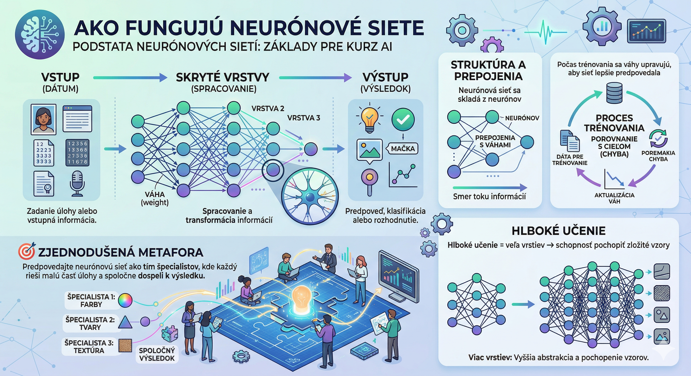

# Introduction to Artificial Intelligence (AI)

## Author

- Ján Bodnár
- Studied finance
- Unix Admin, Java/Python developer
- I train people in Java basics, Python, data analysis, and AI

## Training

- Duration: 2 days, from 9:00 AM to 3:00 PM
- A short 10-minute break at 10:30 AM
- 12:00 – 1:00 PM lunch break

## Definition

*Artificial Intelligence (AI)* is a technology that enables computers to learn from data  
and find solutions without us having to specify every step precisely. Instead of  
hard-coded procedures, AI can recognize patterns, adapt to new  
situations, and solve tasks similarly to a human.

> **Simply put:** AI is a computer program that can learn from data and help  
> us solve tasks – from writing texts to recognizing images.


Key characteristics of AI models

- they are a wellspring of knowledge
- they perform cognitive functions

**A brief history:**
- **1950s:** The beginnings – Alan Turing laid the theoretical foundations
- **1970s:** Expert systems – computers solving specific tasks
- **1990s:** Machine learning – computers learn from data
- **2010s+:** Deep learning and large language models – today's "smart" AI


## Areas of Application

| Area | How AI helps | Example tool |
|--------|--------------|------------------|
| ✍️ **Writing** | Generates ideas, writes texts, corrects grammar | ChatGPT, Claude |
| 🎨 **Images** | Creates graphics from a text description | DALL-E, Midjourney |
| 🎵 **Music** | Composes melodies, generates background music | Suno, AIVA |
| 🎬 **Video** | Edits, generates scenes, creates effects | Runway, Pika |
| 💻 **Programming** | Suggests code, finds bugs, explains functions | GitHub Copilot |
| 🤖 **Robots** | Enables autonomous decision-making | Industrial robots, drones |

My students use AI for:

- legal analysis of contracts
- learning foreign languages
- creating advertising materials
- finding recipes
- professional language translation
- writing Python scripts (as non-programmers)
- finding and comparing the best prices for Apple products
- summarizing texts
- creating presentations
- writing short stories and essays
- creating comics

## How AI Learns

### Machine learning in a nutshell:

1. **Data** → AI receives many examples (e.g., photos of cats and dogs)
2. **Training** → It looks for patterns and differences between the examples
3. **Prediction** → Once trained, it can classify new photos

**Three main types of learning:**
- 🟢 **Supervised learning:** Data is labeled (e.g., "this is a cat")
- 🔵 **Unsupervised learning:** AI itself looks for groups and patterns in the data
- 🟡 **Reinforcement learning:** AI learns by trial and error, receiving "rewards" for correct decisions

### Neural networks – inspired by the brain:



```
Input (data) → Hidden layers (processing) → Output (result)
```
- A network consists of "neurons" connected by weights
- During training, the weights are adjusted so that the network predicts better
- **Deep learning** = many layers → the ability to understand complex patterns

> 🎯 **Simplified metaphor:** Imagine a neural network as a team of specialists, where each one solves a small
> part of the task and together they reach the result.

## Large Language Models (LLMs)

**LLMs** (e.g., GPT, Gemini, LLaMA) are AIs trained on billions of texts from the internet. They can:

- Understand context and answer questions
- Write emails, articles, code
- Translate and summarize texts
- Explain complex topics simply

**How do they work?**

- They learn statistical patterns: "Which word most often follows...?"
- The more parameters ("brain size"), the better they understand nuances
- They cannot "think" like humans – they predict the most likely answer

## Sources of Information and Knowledge


*The internet iceberg – the visible part (above the surface) represents the everyday web content that people visit daily.
Hidden below the surface is a much larger part of the internet: specialized databases, scientific archives, forums,
digitized books, and other text sources. It is precisely from this enormous amount of data that large language models (LLMs) are trained.*

## Token – the unit of text processing

In the context of artificial intelligence, specifically large language models (LLMs), tokens are  
the basic building blocks of text. Think of them as the "words" a machine understands,  
although they do not always match the human notion of a word. The model does not work directly with letters,  
but with numerical representations of these tokens.

**How do they work?**

Before an AI model processes or generates text, it splits it into smaller parts – tokens.  
This process is called tokenization. One token can represent:

*   A whole short word (e.g., "table", "and"),
*   A part of a longer word (e.g., "neuro" + "nal" + "network"),
*   Or a single character or punctuation mark (e.g., ".", "!", a space).

**Tokenization example:**
Sentence: "Artificial intelligence changes the world."
The model might split it into tokens roughly like this:  
`["Art", "ificial", " intelligence", " changes", " the", " world", "."]`

**Why are tokens important?**

1.  **Context window:** Models have a technical limit on the number of tokens they can "see" at once  
   (input prompt + output answer). This limit determines how much text the model remembers within  
   a single conversation or document analysis.  
2.  **Cost and speed:** Most AI services charge based on the number of tokens processed.  
   The more complex the language or the longer the text, the more tokens are needed, which affects the price and the time  
   it takes to generate an answer.
3.  **Language specifics:** English usually tokenizes more efficiently (fewer tokens per word)  
    than Slovak or Czech. The reason is the more complex grammar, inflection, and word length in Slavic  
    languages, which can lead to higher token consumption for the same content.  

Understanding tokens is key to optimizing prompts, estimating costs, and working effectively with AI tools.

## Knowledge Cut-off

**Knowledge cut-off** (the boundary/ceiling of knowledge) is the date up to which a given AI model was trained on  
data from the internet, books, and other sources. Think of it as the "birth date" of the model's knowledge – everything  
that happened after this date is unknown to the model, unless it has access to external tools such as web search.

AI models do not learn continuously in real time. Their training is a demanding and time-consuming process that happens  
in specific cycles:

1.  **Data collection:** The model is "fed" a huge amount of texts from various sources.
2.  **Training:** The model learns patterns, connections, and language structures.
3.  **Freezing:** Once training is complete, the model is "frozen" – its knowledge base no longer changes until a new version is released.

Practical implications for users

| Situation | What can happen | How to prevent it |
|----------|----------------|------------------|
| **Asking about a current event** | The model may answer that it "has no information" or provide outdated data. | Turn on **Web Search** or verify the information in current sources. |
| **Working with the latest technologies** | The model may not know the newest software versions released after the cut-off date. | Specify the context in the prompt or upload the documentation as a file. |
| **Statistics and data** | Figures (e.g., population numbers, cryptocurrency prices) may be historical, not current. | Always verify numerical data in real time. |
| **Scientific discoveries** | The latest studies or publications after the cut-off date are not included in the model. | Use search or academic databases for the newest findings. |


**Summary for students:**

> Knowledge cut-off is not a flaw of the model, but one of its technical characteristics. Think of AI as a very intelligent student who has in their head everything they learned up to a certain date, but for newer events they have to look into the "textbook" (the web) or ask you. Knowing where this boundary lies will help you ask better questions and critically evaluate answers.


## Chatbots – AI as Your Assistant


| Chatbot / Model | Developer | Main strengths and focus | Official link |
| :--- | :--- | :--- | :--- |
| **ChatGPT** | OpenAI | **The versatile leader.** Best multimodality (image, real-time voice) and a huge library of GPT agents. | [chatgpt.com](https://chatgpt.com) |
| **Claude** | Anthropic | **Text quality and ethics.** Most natural written expression, great for creative work and long contexts. | [claude.ai](https://claude.ai) |
| **Gemini** | Google | **Ecosystem and analysis.** Integration with Gmail/Docs and the ability to "see" and analyze long videos or PDFs. | [gemini.google.com](https://gemini.google.com) |
| **Meta AI** | Meta | **Social integration.** Assistant integrated into Messenger, WhatsApp, and Instagram, built on the Llama model. | [www.meta.ai](https://www.meta.ai/) |
| **Perplexity** | Perplexity AI | **Intelligent search.** Answers questions with direct links to sources, replacing classic Google Search. | [perplexity.ai](https://www.perplexity.ai) |
| **DeepSeek** | DeepSeek | **Coding and math.** An extremely efficient model that became a favorite among programmers for its accuracy. | [chat.deepseek.com](https://chat.deepseek.com) |
| **Kimi K2** | Moonshot AI | **Advanced reasoning.** Top-notch in logical tasks and processing huge amounts of data at once. | [kimi.ai](https://kimi.moonshot.cn) |
| **Copilot** | Microsoft | **Office productivity.** Best for generating tables, presentations, and working in the Windows environment. | [copilot.microsoft.com](https://copilot.microsoft.com) |
| **Mistral Large** | Mistral AI | **European efficiency.** Strong performance while preserving privacy, great for enterprise deployment in the EU. | [mistral.ai](https://mistral.ai) |
| **Grok** | xAI | **Real-time insight.** Unique access to current posts on X (Twitter) and an informal communication style. | [x.ai](https://x.ai) |
| **Qwen** | Alibaba | **Multilingual coding.** Excels at technical tasks and communicating in various world languages. | [chat.qwenlm.ai](https://chat.qwenlm.ai) |
| **Pi** | Inflection AI | **Emotional support.** Designed as a personal companion for long conversations and reflection, with a very kind tone. | [pi.ai](https://pi.ai) |


### Which one should you try first?

  * **If you want the best free mobile experience:** Try **Meta AI** or **ChatGPT**.
  * **If you're writing a paper or an article:** Try **Claude** – its style is the least "artificial".
  * **If you're doing market research:** Try **Perplexity** – it will save you hours of clicking through websites.
  * **If you're stuck in code:** **DeepSeek** or **Qwen** will probably help you fastest in 2026.

Would you like me to help you register for any of these services or explain which features are in the paid vs. free version?

**What chatbots can do:**
- Answer questions in natural language
- Help with brainstorming and planning
- Explain code or technical concepts
- Remember the context of the conversation (within a session)

**What they cannot do (yet):**
- ❌ They have no real "consciousness" or emotions
- ❌ They can make mistakes or "make up" facts (hallucinations)
- ❌ They cannot access private data without explicit permission

> ⚠️ Always verify critical information from another source!

---

## How to Write Good Prompts? (Beginner's Guide)

**Prompt** = the instruction you give AI to generate a response.

### 5 golden rules:

1. **Be specific**  
   ❌ "Write something about marketing."  
   ✅ "Write 3 bullet points about the benefits of email marketing for small businesses."

2. **Provide context**  
   ✅ "Explain the term 'neural network' so that a 5th grader can understand it."

3. **Assign a role**  
   ✅ "Act as an experienced UX designer and suggest 5 improvements for this page..."

4. **Specify the format**  
   ✅ "Give the answer in the form of a table with columns: Benefit / Example / Risk."

5. **Show an example (optional)**  
   ✅ "Format the answer like this: [Example]"

### Template of a good prompt:
```
[Role] + [Task] + [Context] + [Format] + [Constraints]

Example:
"Act as an AI training instructor. Explain to a beginner what prompt engineering is. 
Use simple examples from everyday life. Give the answer in 5 bullet points, max. 2 sentences per bullet point."
```

> 🔄 **Iteration is key:** If the first answer isn't ideal, adjust the prompt and try again.

---

## Practical Examples for the Training

### Summarizing text
```
Prompt: "Summarize this article about climate change into 3 main points for managers."
Output: A brief overview without technical jargon.
```
**Use case:** Quickly processing long reports, emails, articles.

### Translation with context
```
Prompt: "Translate this technical description into English. Keep the technical terms, 
but explain them in parentheses for beginners."
```
**Advantage over classic translators:** AI understands context and can adapt the style.

### Extracting information
```
Prompt: "From this résumé, extract: name, last position, 3 key skills. 
Output the result as JSON."
```
**Use case:** Automating the processing of CVs, invoices, forms.

### Sentiment analysis
```
Prompt: "Read these 10 reviews and summarize: What do customers miss the most? 
Which words are repeated in the negative reviews?"
```
**Use case:** A quick overview of feedback without reading everything manually.

---

## Safety and Ethics – What to Keep in Mind

✅ **Good practices:**
- Verify facts from critical AI answers
- Don't share sensitive/company data with public chatbots
- Be transparent if AI created the content
- Respect copyrights when generating images/texts

❌ **Common beginner mistakes:**
- Blindly trusting answers without checking them
- Expecting AI to "know everything" – it has gaps in knowledge
- Using AI for tasks requiring human judgment without supervision

> **Training conclusion:** AI is a powerful tool, but like any tool – it requires understanding,
> responsibility, and critical thinking.


## Quick Glossary of Terms

| Term | Explanation |
|-------|-------------|
| **AI / Artificial Intelligence** | Systems that imitate human thinking and learning |
| **Machine learning** | AI that learns from data instead of explicit programming |
| **LLM** | Large language model – AI trained on billions of texts |
| **Prompt** | The instruction or question you give to AI |
| **Training** | The process in which AI learns from examples and adjusts its "weights" |
| **Parameters** | Numerical "settings" of the model – the more there are, the more complex patterns it can capture |
| **Hallucination** | When AI generates an incorrect but convincingly sounding answer |
| **Neural network** | A computational model inspired by the human brain, consisting of interconnected "neurons" |
| **Deep learning** | Using neural networks with many layers to solve complex tasks |
| **Token** | The basic unit of text for AI (approximately ¾ of a word in English, often shorter segments in Slovak) |
| **Context window** | The maximum amount of text (prompt + answer) that AI remembers within a single conversation |
| **Temperature (of the model)** | The "creativity" setting – a higher value means more randomness and originality, a lower value means more precise and conservative answers |
| **Fine-tuning** | Additional training of an already finished model on a specific task or data |
| **RAG (Retrieval-Augmented Generation)** | A technique in which AI first searches for relevant information from an external source and only then generates the answer |
| **Few-shot learning** | The ability of AI to learn a task from a few examples given directly in the prompt |
| **Prompt engineering** | The art of formulating input instructions so that AI provides the best possible answer |
| **Overfitting** | When a model adapts too much to the training data and generalizes poorly to new situations |
| **Algorithm** | An exact procedure or set of steps according to which AI solves a task |
| **Data** | Information (text, images, numbers...) that AI learns from or processes |


## Questions and Discussion
