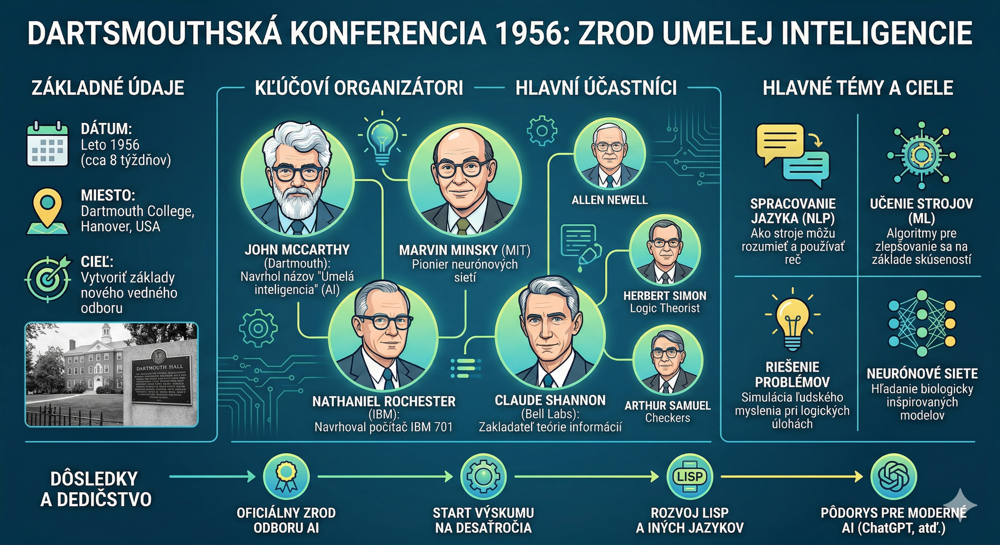

# História umelej inteligencie  

Umelá inteligencia (AI) je odbor informatiky, ktorý skúma metódy, ktoré  
umožňujú počítačom vykonávať úlohy spájané s ľudskou inteligenciou. Patria  
medzi ne vnímanie, učenie, plánovanie, porozumenie jazyku a rozhodovanie.  
AI nie je  
jeden algoritmus, ale široká skupina prístupov – od pravidiel a logiky až po  
neurónové siete trénované na dátach.  

Vývoj AI neprebiehal priamočiaro. Obdobia veľkého optimizmu striedali  
fázy,  
keď technológia nedokázala splniť sľuby a financovanie výskumu kleslo.  
Dnešný  
pokrok stojí najmä na kombinácii kvalitných dát, výkonného hardvéru,  
pokročilých algoritmov a rozsiahleho inžinierskeho zázemia.  

## Obsah  

- [Rané základy](#rané-základy)  
- [Dartmouthská konferencia](#dartmouthská-konferencia-1956)  
- [Symbolická AI a prvé systémy](#symbolická-ai-a-prvé-systémy)  
- [AI zimy](#ai-zimy)  
- [Návrat strojového učenia](#návrat-strojového-učenia)  
- [Hlboké učenie a moderná AI](#hlboké-učenie-a-moderná-ai)  
- [Veľké jazykové modely](#veľké-jazykové-modely)  
- [AI a vízie sci-fi](#ai-a-vízie-sci-fi)  
- [Výzvy a príležitosti](#výzvy-a-príležitosti)  

---  

## Rané základy  

### Myšlienky pred vznikom odboru  

Korene AI siahajú k formálnej logike, teórii pravdepodobnosti a  
teórii  
výpočtu. Alan Turing v práci *On Computable Numbers* (1936) opísal  
abstraktný model výpočtu, dnes známy ako Turingov stroj. Nešlo o hotový  
počítač, ale o teoretický základ pre uvažovanie o tom, čo možno algoritmicky  
vypočítať.  

V článku *Computing Machinery and Intelligence* (1950) Turing položil otázku  
„Môžu stroje myslieť?“ a navrhol imitáciu rozhovoru, neskôr známu ako  
Turingov test. Test meria podobnosť správania v konverzácii; sám osebe však  
nie je dôkazom vedomia, porozumenia ani všeobecnej inteligencie.  

Už v 40. rokoch vznikali aj prvé umelé neurónové modely. Práca Warrena  
McCullocha a Waltera Pittsa (1943) ukázala, ako možno jednoduché logické  
operácie modelovať pomocou idealizovaných neurónov. Tieto myšlienky neskôr  
ovplyvnili vývoj perceptrónov a neurónových sietí.  

## Dartmouthská konferencia (1956)  

Za symbolický začiatok AI ako samostatnej vedeckej disciplíny sa často  
považuje letný workshop na Dartmouth College v Hannoveri v roku 1956.  
Organizátormi boli John McCarthy, Marvin Minsky, Nathaniel Rochester a  
Claude Shannon. V návrhu projektu použili pomenovanie *artificial  
intelligence*, ktoré sa následne rozšírilo.  

  

Návrh vychádzal z odvážnej hypotézy, že aspekty učenia a inteligencie  
možno  
opísať dostatočne presne na to, aby ich stroj dokázal simulovať. Táto  
hypotéza otvorila priestor pre výskum logického uvažovania, riešenia úloh,  
jazyka, vnímania aj učenia. Neznamenala však, že všeobecná inteligencia  
bude vytvorená v krátkom čase.  

Medzi dôležité osobnosti raného obdobia patrili aj Allen Newell a Herbert  
Simon, autori programu Logic Theorist. Program dokázal dokazovať vybrané  
matematické vety pomocou symbolického vyhľadávania. John McCarthy neskôr  
navrhol jazyk LISP (1958), ktorý sa stal významným nástrojom výskumu AI.  

> **Pre študentov:** AI od začiatku nebola iba programovaním pravidiel.  
> Spájala matematiku, logiku, psychológiu, lingvistiku, filozofiu a  
> inžinierstvo.  

## Symbolická AI a prvé systémy  

Rané systémy vychádzali z predstavy, že inteligentné správanie možno  
vytvoriť  
manipuláciou so symbolmi podľa explicitných pravidiel. Tento smer sa neskôr  
označoval aj ako symbolická AI alebo GOFAI (*Good Old-Fashioned AI*).  

- **Logic Theorist** (1956): dokazoval vybrané tvrdenia z matematickej logiky.  
- **Program Arthura Samuela** (od 50. rokov): učil sa hrať dámu a patril k  
  raným príkladom strojového učenia.  
- **ELIZA** (1966, Joseph Weizenbaum): napodobňovala rozhovor s terapeutom  
  pomocou jednoduchých vzorov a pravidiel.  
- **Shakey** (1966 – 1972): jeden z prvých mobilných robotov schopných  
  kombinovať vnímanie, plánovanie a pohyb v obmedzenom prostredí.  

Symbolické programy boli účinné v presne vymedzených doménach. Ťažko však  
zvládali neúplné informácie, nejednoznačný jazyk, zmyslové dáta a takzvaný  
zdravý rozum. Ručné vytváranie a údržba znalostných pravidiel boli navyše  
časovo náročné.  

## AI zimy  

**AI zima** je obdobie poklesu financovania, záujmu a dôvery v AI.  
Prvá  
výrazná zima prišla v 70. rokoch po tom, čo sa ukázalo, že rané metódy  
nezvládajú rozsah a zložitosť reálneho sveta. K poklesu prispeli aj kritické  
hodnotenia, napríklad Lighthillova správa z roku 1973 vo Veľkej Británii.  

Druhá AI zima sa spája najmä s koncom 80. a začiatkom 90. rokov.  
Expertné  
systémy boli drahé na údržbu, ťažko sa prenášali do nových oblastí a často  
nedokázali využívať nové skúsenosti. Krach trhu so špecializovaným AI  
hardvérom znížil dôveru investorov. Výskumníci preto často používali užšie  
označenia ako strojové učenie, rozpoznávanie vzorov či štatistické metódy.  

> **Poučenie:** Technologické sľuby musia zodpovedať reálnym schopnostiam,  
> nákladom a dostupným dátam. Merateľné výsledky a realistické očakávania  
> sú dôležité pre dlhodobý rozvoj každého odboru.  

## Návrat strojového učenia  

Od 80. rokov sa postupne presadzoval prístup, pri ktorom sa systém neučí  
iba ručne napísané pravidlá, ale parametre modelu získava z príkladov.  
Výrazný vplyv mal algoritmus spätného šírenia chyby, ktorý umožnil účinnejšie  
trénovať viacvrstvové neurónové siete. Dôležitú úlohu zohrali Geoffrey  
Hinton, David Rumelhart a Ronald Williams.  

Yann LeCun a spolupracovníci ukázali praktickú silu konvolučných neurónových  
sietí pri rozpoznávaní rukopisu. V roku 1997 systém Deep Blue od IBM  
porazil  
v zápase Garriho Kasparova. Deep Blue však nebol všeobecne inteligentný  
človek podobný systém; používal špecializovaný hardvér, vyhľadávanie a  
šachové heuristiky.  

## Hlboké učenie a moderná AI  

Rozmach AI po roku 2010 podporili tri navzájom sa posilňujúce faktory:  

1. **Výpočtový výkon:** GPU umožnili efektívne paralelné operácie pri tréningu  
   veľkých neurónových sietí.  
2. **Veľké datasety:** internet, senzory a digitalizované archívy poskytli  
   veľké množstvo textov, obrázkov, zvuku a ďalších dát.  
3. **Algoritmy a nástroje:** zlepšili sa architektúry, optimalizácia,  
   dostupnosť dátových súborov aj softvérových knižníc.  

### Dôležité míľniky  

- **ImageNet** (2009): rozsiahly dataset, ktorý urýchlil vývoj počítačového  
  videnia.  
- **AlexNet** (2012): neurónová sieť, ktorá výrazne uspela v súťaži ImageNet  
  a spopularizovala hlboké učenie.  
- **AlphaGo** (2016): systém spoločnosti DeepMind porazil profesionálneho  
  hráča Go Lee Sedola; využil neurónové siete a posilňované učenie.  
- **TensorFlow** (2015) a **PyTorch** (2016): frameworky, ktoré zjednodušili  
  vývoj a výskum strojového učenia.  

> **Dôležité rozlíšenie:** Strojové učenie je spôsob, ako model získava  
> správanie z dát. Hlboké učenie je jeho podskupina využívajúca viacvrstvové  
> neurónové siete. AI je širší pojem, ktorý zahŕňa aj pravidlá, plánovanie a  
> ďalšie metódy.  

## Veľké jazykové modely  

Veľké jazykové modely (LLM) sú modely trénované na veľkom množstve textu,  
ktoré sa učia štatistické vzťahy medzi časťami jazyka. Počas generovania  
predpovedajú ďalšie tokeny podľa kontextu. Vďaka veľkosti a dodatočnému  
tréningu dokážu sumarizovať, prekladať, odpovedať na otázky a generovať kód.  

### Kľúčové míľniky  

- **Transformer** (2017): architektúra založená na mechanizme pozornosti,  
  ktorá zlepšila spracovanie dlhších sekvencií a škálovanie tréningu.  
- **BERT** (2018): model, ktorý výrazne ovplyvnil porozumenie kontextu v NLP.  
- **GPT-3** (2020): ukázal, že škálovanie jazykových modelov prináša nové  
  schopnosti pri práci s textom.  
- **ChatGPT** (2022): sprístupnil konverzačné používanie generatívnej AI  
  širokej verejnosti.  
- **Multimodálne a uvažujúce modely** (2023 – 2026): kombinujú text s  
  obrazom, zvukom či kódom a pri niektorých úlohách používajú dlhšie  
  vnútorné postupy riešenia alebo externé nástroje.  

LLM však nie sú databáza ani záruka pravdy. Môžu vytvoriť presvedčivo znejúcu  
nepravdivú informáciu, prehliadnuť kontext, reprodukovať predsudky z dát alebo  
nesprávne interpretovať zadanie. Pri citlivých, odborných a aktuálnych  
témach je preto potrebné overenie v dôveryhodných zdrojoch.  

## AI a vízie sci-fi  

Sci-fi často nepredpovedá budúcnosť doslovne. Skôr vytvára myšlienkové  
experimenty, ktoré inžinierom a verejnosti pomáhajú predstaviť si nové  
možnosti i riziká. Niektoré filmové predstavy sa neskôr stali technickými  
analógiami, iné zostali metaforami.  

- *Metropolis* (1927) preslávil obraz humanoidného robota a otázky vzťahu  
  človeka, práce a techniky.  
- *Frau im Mond* (1929) pomohla spopularizovať predstavu raketového letu a  
  odpočítavania pred štartom; nie je však dôkazom, že film túto prax vytvoril.  
- *R.U.R.* (1920) Karla Čapka a Josefa Čapka rozšírilo slovo „robot“.  
  Čapkovi roboti boli umelo vytvorené biologické bytosti, nie kovové stroje.  
- *2001: Vesmírna odysea* (1968) a *Star Trek* zobrazili tablety,  
  videohovory, hlasové rozhrania a prenosné počítače skôr ako bežnú realitu.  
- *Her* (2013) otvoril otázky emocionálnej väzby, identity a hraníc medzi  
  nástrojom a spoločníkom.  
- *Minority Report* (2002) predstavil gestá a všadeprítomné sledovanie; ich  
  dnešné podoby však majú iné technické a spoločenské obmedzenia.  

Rozdiel medzi fikciou a realitou je podstatný. Dnešné systémy dokážu  
napodobniť rozhovor, rozpoznať obraz či generovať text, ale nemajú automaticky  
ľudské vedomie, zámery ani spoľahlivý zdravý rozum.  

## Výzvy a príležitosti  

AI môže pomáhať vo výskume, medicíne, vzdelávaní, pri preklade, programovaní  
a analýze dát. Súčasne prináša riziká: ochranu súkromia, bezpečnosť,  
dezinformácie, diskrimináciu, zmenu pracovných rolí, autorské otázky a  
spotrebu energie. Technická kvalita modelu preto nie je jediným kritériom  
úspechu. Dôležité sú aj transparentnosť, zodpovednosť, ľudský dohľad a  
primerané pravidlá používania.  

Pri práci s AI je užitočné riadiť sa jednoduchým postupom:  

1. **Určiť cieľ a riziko:** Iné nároky má návrh nápadov a iné medicínske  
   alebo právne rozhodnutie.  
2. **Overiť vstupy a výstupy:** Skontrolovať zdroje, výpočty, citácie aj  
   predpoklady modelu.  
3. **Použiť vhodný nástroj:** Kalkulačku, databázu, program alebo odborníka  
   tam, kde je potrebná presnosť či aktuálnosť.  
4. **Zachovať ľudskú zodpovednosť:** Konečné rozhodnutie nesmie byť bezhlavo  
   prenesené na systém, ktorý nemusí rozumieť jeho dôsledkom.  

> **Zhrnutie:** História AI je striedaním odvážnych myšlienok, technického  
> pokroku a realistického prehodnocovania očakávaní. Budúcnosť nebude patriť  
> iba jednému prístupu; najspoľahlivejšie riešenia budú spájať učenie z dát,  
> overiteľné pravidlá, kvalitné nástroje a zodpovedný ľudský dohľad.  

## Otázky na diskusiu  

1. Prečo samotná schopnosť viesť prirodzený rozhovor nedokazuje porozumenie?  
2. Čo mali symbolické systémy spoločné s dnešnými jazykovými modelmi a v čom  
   sa zásadne líšia?  
3. Ktoré faktory podľa vás najviac prispeli k úspechu hlbokého učenia po roku  
   2010?  
4. Kde by mal byť pri používaní AI povinný ľudský dohľad?  
5. Ktoré predstavy zo sci-fi sú podľa vás už realitou a ktoré zostávajú  
   vzdialenou víziou?  

## Odporúčané zdroje  

- [Dartmouth workshop – návrh projektu z roku 1955](https://www.dartmouth.edu/dartmouth-history/artificial-intelligence-ai-coined-dartmouth)  
- [Alan Turing: Computing Machinery and Intelligence](https://doi.org/10.1093/mind/LIX.236.433)  
- [Stanford Encyclopedia of Philosophy: Artificial Intelligence](https://plato.stanford.edu/entries/artificial-intelligence/)  
- [Attention Is All You Need](https://arxiv.org/abs/1706.03762)  
