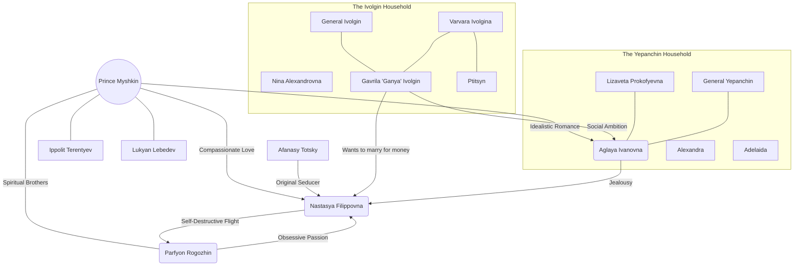

# Tests

## Chart of Idiot's characters

```mermaid
graph TD
    %% Central Characters
    Myshkin((Prince Myshkin))
    Nastasya(Nastasya Filippovna)
    Rogozhin(Parfyon Rogozhin)
    
    %% Yepanchin Family
    subgraph Yepanchins [The Yepanchin Household]
        GeneralY[General Yepanchin]
        Lizaveta[Lizaveta Prokofyevna]
        Aglaya(Aglaya Ivanovna)
        Alexandra[Alexandra]
        Adelaida[Adelaida]
    end

    %% Ivolgin Family
    subgraph Ivolgins [The Ivolgin Household]
        GeneralI[General Ivolgin]
        Nina[Nina Alexandrovna]
        Ganya[Gavrila 'Ganya' Ivolgin]
        Varvara[Varvara Ivolgina]
        Ptitsyn[Ptitsyn]
    end

    %% Supporting Characters
    Ippolit[Ippolit Terentyev]
    Lebedev[Lukyan Lebedev]
    Totsky[Afanasy Totsky]

    %% Relationships
    Myshkin -- "Compassionate Love" --> Nastasya
    Myshkin -- "Spiritual Brothers" --- Rogozhin
    Myshkin -- "Idealistic Romance" --> Aglaya
    
    Rogozhin -- "Obsessive Passion" --> Nastasya
    Nastasya -- "Self-Destructive Flight" --> Rogozhin
    
    Totsky -- "Original Seducer" --> Nastasya
    Ganya -- "Wants to marry for money" --> Nastasya
    Ganya -- "Social Ambition" --> Aglaya
    
    Aglaya -- "Jealousy" --> Nastasya
    
    %% Family Ties
    Lizaveta --- Aglaya
    GeneralY --- Aglaya
    GeneralI --- Ganya
    Varvara --- Ganya
    Varvara --- Ptitsyn
    
    %% Philosophers/Schemers
    Myshkin --- Ippolit
    Myshkin --- Lebedev
```
