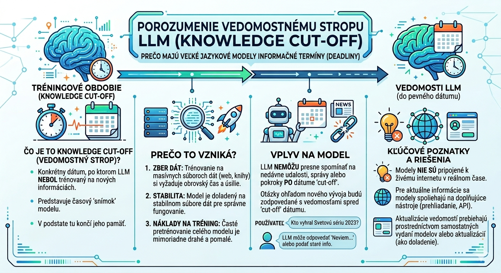

# Úvod do umelej inteligencie (AI)

## Autor 

- Ján Bodnár
- vyštodované financie
- Unix Admin, Java/Python vývojár
- Školím základy Javy, Pythonu, dátovú analýzu a AI

## Školenie 

- trvanie 2 dni, od 9.00 do 15.00
- o 10.30 krátka 10 min prestávka
- 12.00 - 13.00 obedňajšia prestávka


## Definícia

*Umelá inteligencia (AI)* je technológia, ktorá umožňuje počítačom učiť sa z dát  
a hľadať riešenia bez toho, aby sme im museli presne určovať každý krok. Namiesto  
pevne naprogramovaných postupov dokáže AI rozpoznávať vzory, prispôsobovať sa novým  
situáciám a riešiť úlohy podobne ako človek.

> **Jednoducho povedané:** AI je počítačový program, ktorý sa vie učiť z dát a pomáhať  
> nám riešiť úlohy – od písania textov až po rozpoznávanie obrázkov.


Zásadné charakteristiky AI modelov 

- sú studnicou poznania
- vykonávajú kognitívne funkcie


**Stručná história:**
- **1950s:** Začiatky – Alan Turing položil teoretické základy
- **1970s:** Expertné systémy – počítače riešiace špecifické úlohy
- **1990s:** Strojové učenie – počítače sa učia z dát
- **2010s+:** Hlboké učenie a veľké jazykové modely – dnešná „chytrá" AI


## Oblasti využitia

| Oblasť | Ako AI pomáha | Príklad nástroja |
|--------|--------------|------------------|
| ✍️ **Písanie** | Generuje nápady, píše texty, koriguje gramatiku | ChatGPT, Claude |
| 🎨 **Obrázky** | Vytvára grafiku z textového popisu | DALL-E, Midjourney |
| 🎵 **Hudba** | Skladá melódie, generuje hudbu na pozadie | Suno, AIVA |
| 🎬 **Video** | Strihá, generuje scény, vytvára efekty | Runway, Pika |
| 💻 **Programovanie** | Navrhuje kód, hľadá chyby, vysvetľuje funkcie | GitHub Copilot |
| 🤖 **Roboty** | Umožňuje autonómne rozhodovanie | Výrobné roboty, drony |


## Učenie AI

### Strojové učenie v skratke:

1. **Dáta** → AI dostane veľa príkladov (napr. fotky mačiek a psov)
2. **Tréning** → Hľadá vzory a rozdiely medzi príkladmi
3. **Predikcia** → Po natrénovaní vie nové fotky zaradiť

**Tri hlavné typy učenia:**
- 🟢 **S učiteľom:** Dáta sú označená (napr. „toto je mačka")
- 🔵 **Bez učiteľa:** AI sama hľadá skupiny a vzory v dátach
- 🟡 **S posilňovaním:** AI sa učí metódou pokus-omyl, dostáva „odmeny" za správne rozhodnutia

### Neurónové siete – inšpirácia mozgom:

```
Vstup (dátum) → Skryté vrstvy (spracovanie) → Výstup (výsledok)
```
- Sieť sa skladá z „neurónov" prepojených váhami
- Počas trénovania sa váhy upravujú, aby sieť lepšie predpovedala
- **Hlboké učenie** = veľa vrstiev → schopnosť pochopiť zložité vzory

> 🎯 **Zjednodušená metafora:** Predstavte si neurónovú sieť ako tím špecialistov, kde každý rieši malú
> časť úlohy a spoločne dospeli k výsledku.

## Veľké jazykové modely (LLM) 

**LLM** (napr. GPT, Gemini, LLaMA) sú AI trénované na miliardách textov z internetu. Vedia:

- Rozumieť kontextu a odpovedať na otázky
- Písať e-maily, články, kód
- Prekladať a zhrňovať texty
- Vysvetľovať zložité témy jednoducho

**Ako fungujú?**

- Učia sa štatistické vzory: „Aké slovo najčastejšie nasleduje po...?"
- Čím viac parametrov („veľkosť mozgu"), tým lepšie chápu nuansy
- Nevedia „myslieť" ako ľudia – predpovedajú najpravdepodobnejšiu odpoveď

## Zdroje informácií a znalostí


*Ľadovec internetu – viditeľná časť (nad hladinou) predstavuje bežný obsah webu, ktorý ľudia denne navštevujú.
Pod hladinou sa skrýva oveľa rozsiahlejšia časť internetu: odborné databázy, vedecké archívy, fóra,
digitalizované knihy a ďalšie textové zdroje. Práve z tohto obrovského množstva dát sú trénované veľké jazykové modely (LLM).*

## Token - jednotka spracovania textu

V kontexte umelej inteligencie, konkrétne veľkých jazykových modelov (LLM), sú tokeny  
základnou stavebnou jednotkou textu. Predstavte si ich ako „slová", ktorými rozumie stroj,  
hoci sa nie vždy zhodujú s ľudským chápaním slova. Model nepracuje priamo s písmenami,  
ale s číselnými reprezentáciami týchto tokenov.

**Ako fungujú?**

Pred tým, než AI model text spracuje alebo vygeneruje, rozdelí ho na menšie časti – tokeny.  
Tento proces sa nazýva tokenizácia. Jeden token môže predstavovať:

*   Celé krátke slovo (napr. „stôl", „a"),
*   Časť dlhšieho slova (napr. „neuro" + „vá" + „sieť"),
*   Alebo jednotlivý znak či interpunkciu (napr. „.", „!", medzera).

**Príklad tokenizácie:**
Veta: „Umelá inteligencia mení svet."
Môže byť modelom rozložená na tokeny približne takto:  
`[„Umel", „á", „ ", „int", \"elig\", \"encia\", \" \", \"men\", \"í\", \" \", \"svet\", \"."]`

**Prečo sú tokeny dôležité?**

1.  **Kontextové okno:** Modely majú technický limit na počet tokenov, ktoré môžu „vidieť" naraz  
   (vstupný prompt + výstupná odpoveď). Tento limit určuje, koľko textu si model pamätá v rámci  
   jednej konverzácie alebo analýzy dokumentu.  
3.  **Náklady a rýchlosť:** Väčšina AI služieb účtuje cenu na základe počtu spracovaných tokenov.  
   Čím zložitejší jazyk alebo dlhší text, tým viac tokenov je potrebných, čo ovplyvňuje cenu a čas  
   generovania odpovede.
5.  **Jazykové špecifiká:** Angličtina sa zvyčajne tokenizuje efektívnejšie (menej tokenov na slovo)  
    než slovenčina či čeština. Dôvodom je zložitejšia gramatika, skloňovanie a dĺžka slov v slovanských  
    jazykoch, čo môže viesť k vyššej spotrebe tokenov pri rovnakom obsahu.  

Pochopenie tokenov je kľúčové pre optimalizáciu promptov, odhadovanie nákladov a efektívnu prácu s AI nástrojmi.

## Knowledge Cut-off

**Knowledge cut-off** (hranica poznania/strop poznania) je dátum, do ktorého bol daný AI model trénovaný na  
dátach z internetu, kníh a ďalších zdrojov. Predstavte si ho ako „dátum narodenia" vedomostí modelu – všetko,  
čo sa udialo po tomto dátume, model nepozná, pokiaľ nemá prístup k externým nástrojom, ako je vyhľadávanie na webe.

AI modely sa neučia priebežne v reálnom čase. Ich trénovanie je náročný a časovo nákladný proces, ktorý prebieha 
v konkrétnych cykloch:

1.  **Zber dát:** Model sa „kŕmi" obrovským množstvom textov z rôznych zdrojov.
2.  **Tréning:** Model sa učí vzory, súvislosti a jazykové štruktúry.
3.  **Uzavretie:** Po dokončení tréningu sa model „zmrazí" – jeho vedomostná báza sa už nemení, kým nie je vydaná nová verzia.

Praktické dôsledky pre používateľov

| Situácia | Čo sa môže stať | Ako tomu predísť |
|----------|----------------|------------------|
| **Otázka na aktuálnu udalosť** | Model môže odpovedať, že „nemá informácie", alebo uviesť zastarané údaje. | Zapnite **Web Search** alebo overte informáciu v aktuálnych zdrojoch. |
| **Práca s najnovšími technológiami** | Model nemusí poznať najnovšie verzie softvéru, ktoré vyšli po cut-off dátume. | Špecifikujte v prompte kontext alebo nahrajte dokumentáciu ako súbor. |
| **Štatistiky a dáta** | Čísla (napr. počet obyvateľov, ceny kryptomien) môžu byť historické, nie aktuálne. | Vždy si overte číselné údaje v reálnom čase. |
| **Vedecké objavy** | Najnovšie štúdie alebo publikácie po dátume cut-off nie sú v modeli zahrnuté. | Použite vyhľadávanie alebo akademické databázy pre najnovšie poznatky. |



**Zhrnutie pre študentov:**

> Knowledge cut-off nie je chyba modelu, ale jeho technická charakteristika. Predstavte si AI ako veľmi inteligentného študenta, ktorý má v hlave všetko, čo sa naučil do určitého dátumu, ale na novšie udalosti sa musí pozrieť do „učebnice" (webu) alebo sa opýtať vás. Vedieť, kde táto hranica je, vám pomôže klásť lepšie otázky a kriticky vyhodnocovať odpovede.


## Chatboty – AI ako váš asistent

| Chatbot | Vývojár | Silné stránky |
|---------|---------|---------------|
| **ChatGPT** | OpenAI | Univerzálny, kreatívny, dobrý na vysvetľovanie |
| **Copilot** | Microsoft | Integrácia s Office a vývojovými nástrojmi |
| **Gemini** | Google | Práca s viacerými formátmi (text, obrázok, audio) |
| **Qwen** | Alibaba | Vysoký výkon v kódovaní a logickom uvažovaní, podpora dlhého kontextu, multilingválne schopnosti, nákladovo efektívny |
| **Grok** | xAI | Prístup k dátam z platformy X v reálnom čase, pokročilé logické uvažovanie a kódovanie, hlasová komunikácia a generovanie multimédií, „truth-seeking" prístup |
| **DeepSeek** | Čína (High-Flyer) | Efektívny, dobrý pomer výkon/cena, pokročilé chápanie kontextu a spracovanie prirodzeného jazyka, silné schopnosti v kódovaní a matematike  |

**Čo chatboty vedia:**
- Odpovedať na otázky v prirodzenom jazyku
- Pomáhať s brainstormingom a plánovaním
- Vysvetľovať kód alebo technické pojmy
- Pamätať si kontext konverzácie (v rámci relácie)

**Čo (zatiaľ) nevedia:**
- ❌ Nemajú skutočné „vedomie" ani emócie
- ❌ Môžu sa mýliť alebo „vymýšľať" fakty (halucinácie)
- ❌ Nevedia pristupovať k súkromným dátam bez explicitného povolenia

> ⚠️ Vždy overte kritické informácie z iného zdroja!

---

## Ako písať dobré prompty? (Návod pre začiatočníkov)

**Prompt** = inštrukcia, ktorú dáte AI, aby vygenerovala odpoveď.

### 5 zlatých pravidiel:

1. **Buďte konkrétni**  
   ❌ „Napíš niečo o marketingu."  
   ✅ „Napíš 3 odrážky o výhodách e-mail marketingu pre malé firmy."

2. **Dajte kontext**  
   ✅ „Vysvetli pojem 'neurónová sieť' tak, aby tomu rozumel žiak 5. triedy."

3. **Priraďte rolu**  
   ✅ „Konaj ako skúsený UX dizajnér a navrhni 5 vylepšení pre túto stránku..."

4. **Špecifikujte formát**  
   ✅ „Odpoveď daj vo forme tabuľky s stĺpcami: Výhoda / Príklad / Riziko."

5. **Ukážte príklad (voliteľné)**  
   ✅ „Formátuj odpoveď takto: [Príklad]"

### Šablóna dobrého promptu:
```
[Rola] + [Úloha] + [Kontext] + [Formát] + [Obmedzenia]

Príklad:
"Konaj ako lektor AI školenia. Vysvetli začiatočníkovi, čo je to prompt engineering. 
Použi jednoduché príklady z bežného života. Odpoveď daj v 5 odrážkach, max. 2 vety na odrážku."
```

> 🔄 **Iterácia je kľúč:** Ak prvá odpoveď nie je ideálna, upravte prompt a skúste znova.

---

## Praktické ukážky pre školenie

### Zhrnutie textu
```
Prompt: "Zhrň tento článok o klimatických zmenách na 3 hlavné body pre manažérov."
Výstup: Stručný prehľad bez technického žargónu.
```
**Využitie:** Rýchle spracovanie dlhých reportov, e-mailov, článkov.

### Preklad s kontextom
```
Prompt: "Prelož tento technický popis do slovenčiny. Zachovať odborné termíny, 
ale vysvetliť ich v zátvorke pre začiatočníkov."
```
**Výhoda oproti klasickým prekladačom:** AI chápe kontext a vie prispôsobiť štýl.

### Extrakcia informácií
```
Prompt: "Z tohto životopisu vytiahni: meno, poslednú pozíciu, 3 kľúčové zručnosti. 
Výstup daj ako JSON."
```
**Využitie:** Automatizácia spracovania CV, faktúr, formulárov.

### Analýza sentimentu
```
Prompt: "Prečítaj tieto 10 recenzií a zhrň: Čo zákazníkom najviac chýba? 
Aké slová sa opakujú v negatívnych hodnoteniach?"
```
**Využitie:** Rýchly prehľad spätnej väzby bez manuálneho čítania.

---

## Bezpečnosť a etika – na čo myslieť

✅ **Dobré praktiky:**
- Overujte fakty z kritických odpovedí AI
- Nezdieľajte citlivé/firemné dáta s verejnými chatbotmi
- Buďte transparentní, ak obsah vytvorila AI
- Rešpektujte autorské práva pri generovaní obrázkov/textov

❌ **Časté chyby začiatočníkov:**
- Slepo dôverovať odpovediam bez kontroly
- Očakávať, že AI „vie všetko" – má medzery v znalostiach
- Používať AI na úlohy vyžadujúce ľudský úsudok bez dohľadu

> **Záver školenia:** AI je mocný nástroj, ale ako každý nástroj – vyžaduje pochopenie,
> zodpovednosť a kritické myslenie.


## Rýchly slovník pojmov 

| Pojem | Vysvetlenie |
|-------|-------------|
| **AI / Umelá inteligencia** | Systémy, ktoré napodobňujú ľudské myslenie a učenie |
| **Strojové učenie** | AI, ktorá sa učí z dát namiesto explicitného programovania |
| **LLM** | Veľký jazykový model – AI trénovaná na miliardách textov |
| **Prompt** | Inštrukcia alebo otázka, ktorú zadávate AI |
| **Tréning** | Proces, pri ktorom sa AI učí z príkladov a upravuje svoje „váhy" |
| **Parametre** | Číselné „nastavenia" modelu – čím viac, tým komplexnejšie vzory vie zachytiť |
| **Halucinácia** | Keď AI vygeneruje nesprávnu, ale presvedčivo znejúcu odpoveď |
| **Neurónová sieť** | Výpočtový model inšpirovaný ľudským mozgom, skladá sa z prepojených „neurónov" |
| **Hlboké učenie** | Používanie neurónových sietí s mnohými vrstvami na riešenie zložitých úloh |
| **Token** | Základná jednotka textu pre AI (približne ¾ slova v angličtine, v slovenčine často kratšie úseky) |
| **Kontextové okno** | Maximálne množstvo textu (prompt + odpoveď), ktoré si AI pamätá v rámci jednej konverzácie |
| **Teplota (modelu)** | Nastavenie „kreativity" – vyššia hodnota = viac náhodnosti a originality, nižšia = presnejšie a konzervatívnejšie odpovede |
| **Fine-tuning / Doladenie** | Dodatočné trénovanie už hotového modelu na špecifickú úlohu alebo dáta |
| **RAG (Retrieval-Augmented Generation)** | Technika, pri ktorej AI najskôr vyhľadá relevantné informácie z externého zdroja a až potom generuje odpoveď |
| **Few-shot learning** | Schopnosť AI naučiť sa úlohu z niekoľkých príkladov uvedených priamo v prompte |
| **Prompt engineering** | Umenie formulovať vstupné inštrukcie tak, aby AI poskytla čo najlepšiu odpoveď |
| **Overfitting / Pretrénovanie** | Keď sa model príliš prispôsobí trénovacím dátam a zle zovšeobecňuje na nové situácie |
| **Algoritmus** | Presný postup alebo návod, podľa ktorého AI rieši úlohu |
| **Dáta** | Informácie (text, obrázky, čísla...), z ktorých sa AI učí alebo ktoré spracúva |


